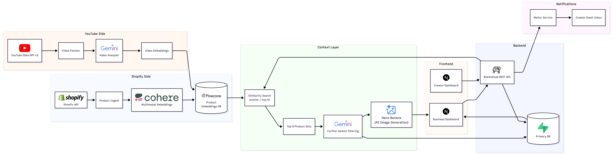

# Maatchaa

AI-powered sponsorship matching for YouTube Shorts. Connects Shopify merchants with YouTube creators automatically.

🏆 **Hack the North 2025 Finalist** · [Live Demo](https://maatchaa.vercel.app)

## The Problem

Small Shopify brands don't have the budget for influencer marketing agencies, and micro-creators with engaged audiences have no streamlined way to find brand deals. Manually searching through thousands of YouTube Shorts to find creators whose content matches a product's aesthetic doesn't scale. Maatchaa automates that matching using AI embeddings so both sides can find each other in minutes instead of weeks.

## How it works

1. **Product Ingestion** — Merchant connects their Shopify store via OAuth. We sync their product catalog and generate vector embeddings of product descriptions and images using Cohere Embed v3.
2. **Creator Discovery** — A background worker searches YouTube Shorts, downloads transcriptions, and analyzes video content with Gemini Flash. Each video gets embedded and stored in Pinecone.
3. **Smart Matching** — The merchant sees AI-ranked creator matches in a Tinder-style card swipe interface. Matches are scored by cosine similarity between product and video embeddings.
4. **Partnership Flow** — Merchant swipes right, creator gets notified, and on acceptance the sponsor links are added to the video description automatically.

## Architecture



## Tech Stack

| Layer | Technology | Why |
|-------|-----------|-----|
| Frontend | Next.js 15, React 19, Radix UI | Server components for fast initial loads, Radix for accessible UI primitives |
| Backend | Python, BlackSheep | Async-first framework, good fit for I/O-heavy external API calls |
| Database | Supabase (Postgres) | Realtime subscriptions for live partnership notifications, row-level security |
| Vector Search | Pinecone + Cohere Embed v3 | Sub-100ms similarity search across product and video embeddings |
| Video Analysis | Gemini 1.5 Flash | Multimodal analysis of both visual frames and transcriptions |
| Auth | Shopify OAuth 2.0 | Direct store verification and product catalog access |
| Deployment | Vercel (frontend), Google Cloud Run (backend) | Auto-scaling with zero-config deploys |

## Getting Started

### Prerequisites

- Python 3.11+
- Node.js 18+
- API keys for: Shopify (Partner account), YouTube Data API, Pinecone, Cohere, Gemini

### Backend

```bash
cd backend
python -m venv venv && source venv/bin/activate
pip install -r requirements.txt
cp .env.example .env   # fill in your API keys
uvicorn API:app --host 0.0.0.0 --port 8000
```

### Frontend

```bash
cd frontend
npm install
cp .env.example .env.local   # fill in Supabase URL and API base URL
npm run dev
```

### Running Tests

```bash
cd backend
python -m pytest tests/ -v
```

### Docker

```bash
docker build -t maatchaa .
docker run -p 8080:8080 --env-file backend/.env maatchaa
```

---

Built at [Hack the North 2025](https://hackthenorth.com)
